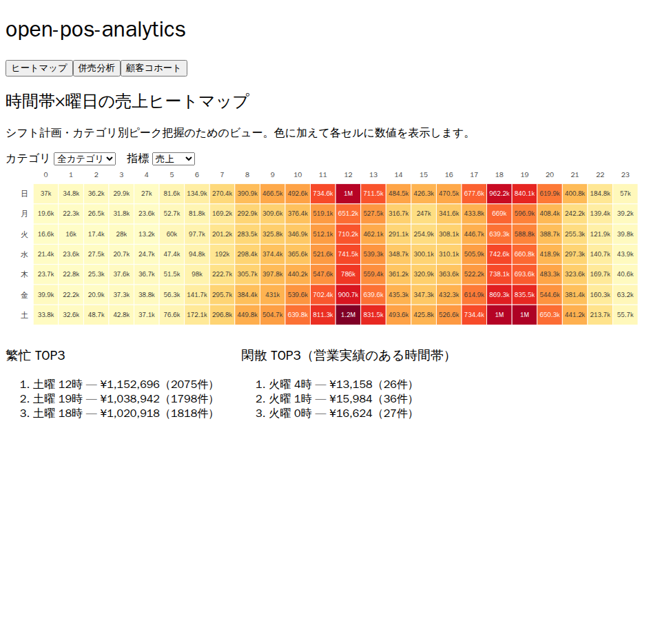
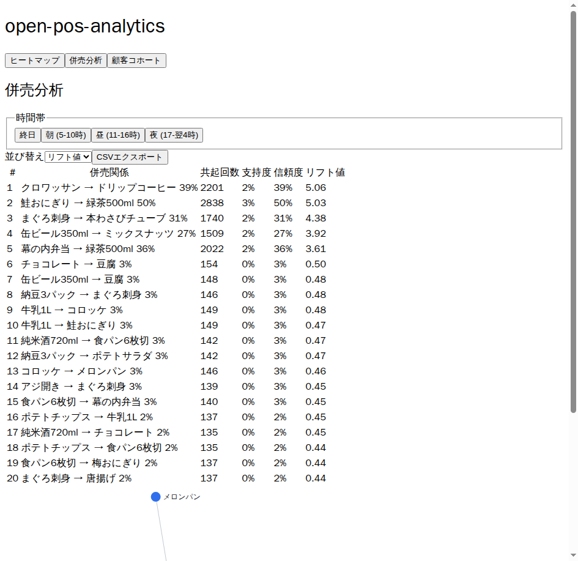
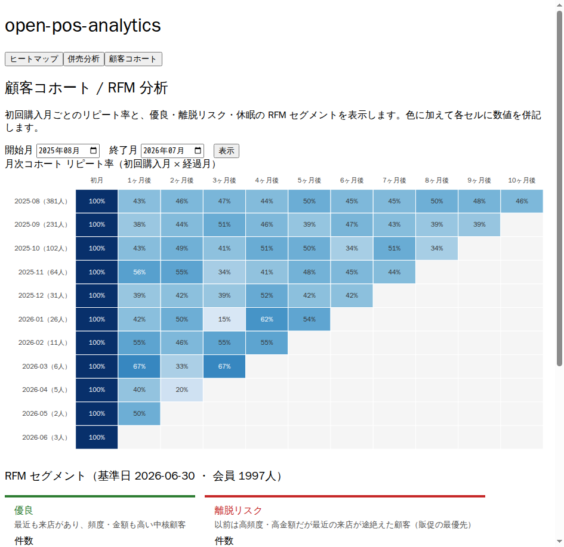

# open-pos-analytics

[](https://github.com/akaitigo/open-pos-analytics/actions/workflows/ci.yml)

[open-pos](https://github.com/akaitigo/open-pos) の売上データを「店主が5分で読める」分析に変える3モジュール拡張。



| 併売分析（リフト値ランキング + ネットワーク図） | 顧客コホート / RFM セグメント |
|---|---|
|  |  |

※ すべて同梱のサンプルデータ生成器（10万トランザクション）による実表示。

| モジュール | 何がわかるか |
|-----------|-------------|
| **heatmap** | 時間帯×曜日の売上ヒートマップ。カテゴリ別ピーク時間帯（惣菜は夕方、パンは朝） |
| **basket** | 併売分析。「クロワッサン購入者の39%がコーヒーも買う」— リフト値ランキングと陳列改善のヒント |
| **cohort** | 顧客コホート/RFM分析。優良・休眠・離脱リスクのセグメント可視化 |

## 技術スタック

- Backend: Kotlin / Quarkus（分析API・open-pos データ取込）
- Frontend: TypeScript / React (Vite) + D3.js
- DB: PostgreSQL（事前集計テーブル方式）

## セットアップ

前提: JDK 21 / Node.js 22+ / Docker（PostgreSQL は Quarkus Dev Services が自動起動）

```bash
# 1. Backend 起動
cd backend && ./gradlew quarkusDev
# → http://localhost:8080

# 2. サンプルデータ生成 → 取込 + 集計（別ターミナル）
cd backend && ./gradlew generateSampleData --args="/tmp/sample.csv 100000 42"
curl -X POST localhost:8080/api/admin/ingest \
  -H 'Content-Type: application/json' \
  -d '{"path":"/tmp/sample.csv"}'

# 3. Frontend 起動
cd frontend && npm install && npm run dev
# → http://localhost:5173 で3モジュールのダッシュボードが見られる
```

実データは open-pos からエクスポートした同形式の CSV を `/api/admin/ingest` に渡す（ADR-0002）。管理エンドポイントはローカル運用前提の無認証（[ADR-0004](docs/adr/0004-unauthenticated-admin-endpoints.md)）。

## 開発

```bash
make check     # lint → test → build（backend + frontend）
make quality   # 品質ゲート
```

設計判断は [docs/adr/](docs/adr/)、要求仕様は [PRD.md](PRD.md) を参照。

## ステータス

v1.0.0リリース済み。heatmap・basket・cohortの3モジュールをサンプルデータで再現できる保守フェーズです。由来: プロジェクトアイデア #2998 + #3008 + #3018 の統合。

## License

MIT
